```{r setup, include=FALSE, results='hide'}
knitr::opts_chunk$set(echo = TRUE)
library(here)
```

# Data input

-   Marine Ecoregions of the World: 232 ecoregions, 62 provinces, and 12 realms, [Spalding et al., 2007](https://doi.org/10.1641/B570707) [@spalding_marine_2007]
-   Deep sea GOODS provinces: 14 bathyal and 14 abyssal provinces [Watling et al., 2013](https://doi.org/10.1016/j.pocean.2012.11.003) [@watling_proposed_2013]
-   Hadal provinces [Belyaev, 1989](https://escholarship.org/uc/item/46n6148x) [@belyaev_deep_1989]
-   Global depth raster from [GEBCO](https://www.gebco.net/) [@gebco_bathymetric_compilation_group_gebco_2020_2020]

# Analysis steps

## Part 1: check validity of DSP geometries

-   Step \#1: Both the bathyal and abyssal layers were checked because we noticed some wrong geometries in it when trying to perform geometric operations on Arc/QGIS. A lot of points were identified with wrong geometries because of self-intersections.

    [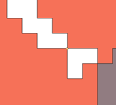](figure1) 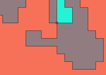 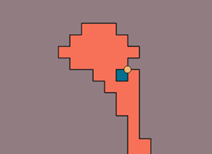{width="212"}

-   Step \#2: The validity of geometries was checked with the command "Check validity" of QGIS `Vector → Geometry Tools → Check Validity → Input Layer: BATHYAL/ABYSSAL`

    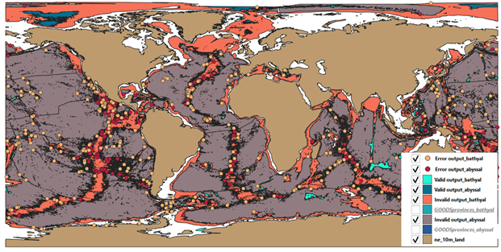

## Part 2: correcting geometries for the DSP shapefile layers

-   Step \#1: check validity of geometries on R with the sf function `st_is_valid()`to check what geometric problem is occurring. All issues are due to self-intersections on both objects

-   Step \#2: correct the geometric issues in both layers with the sf R function `st_make_valid()`

-   Step \#3: files saved with the function with the sf R function `st_write()`

```{r code a., code = readLines(here("./code/create_layer/a.fix_deep_sea_layers.R")), eval = FALSE}
```

## Part 3: Removing irregularities from the bathyal shapefile

-   Step \#1: identification of areas: off the Florida coast, because the threshold of 800m is arbitrary and this is a "transition" zone

    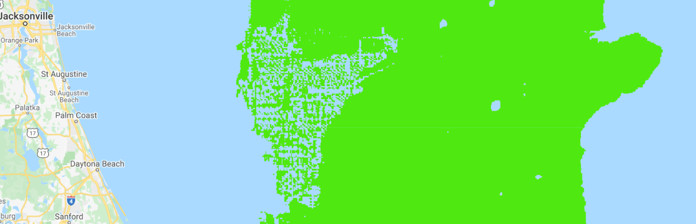

-   Step \#2: fixed on R, using GEBCO and adding additional areas to the bathyal layer

-   Step \#3: all polygons intersecting the depth raster (in blue below) are merged via `st_union()` to create one larger replacing polygons, added to the bathyal layer

    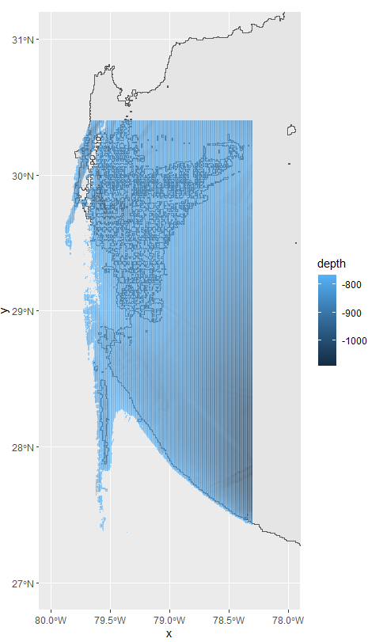{width="293"}

-   Step \#4: geometry checked again and file saved with the function with the sf R function`st_write()`

```{r code b., code = readLines(here("./code/create_layer/b.remove_irregularities.R")), eval = FALSE}
```

## Part 4: Merging the bathyal and abyssal shapefile layers

-   Step \#1: Check that the layers are perfectly complementary to each other by manual visualization, and they are not

    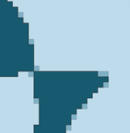 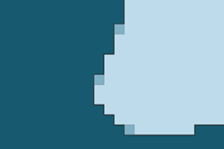 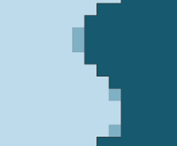

-   Step \#2: Creating perfectly complementary abyssal and bathyal layers, by taking the difference between the two layers. All grid cells that are shared between the abyssal and bathyal habitats will be associated with the bathyal layer, because they may represent more potential habitat than abyssal areas.

    Operation: geometric difference between the bathyal layer and the abyssal layer

    `QGIS: Vector → Geoprocessing tools → Difference → Input Layer: bathyal, Overlay Layer: abyssal`

-   `ArcGIS: Geoprocessing → Pairwise Erase, input = abyssal, erase = bathyal, output = p4s2`

-   Step \#3: Creating one shapefile with the abyssal and bathyal layers which I will then call the deepsea layer.

    Operation: merging layers of the two shapefiles to form one deep sea shapefile

    `QGIS: Vector → Data Management Tools → Merge layers → Input Layers: ABYSSAL + BATHYAL` `ArcGIS: Merge, input = p4s2, input = GOODSprovinces_bathyal_irregularities, output = GOODSprovinces_p4s3`

-   Step \#4: Correcting invalid geometry manually

    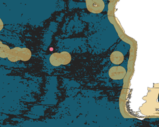

## Part 5: Merging the coastal and deep sea shapefile layers

-   Step \#1: Here, two options are possible: (i) removing marine ecoregion areas and keeping them associated with the deep-sea layers (ii) removing areas from the deep sea areas and keeping them associated with the ecoregions.

    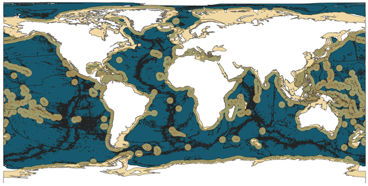

    Operation (i): geometric difference between the MEOW layer and the DEEPSEA layer

    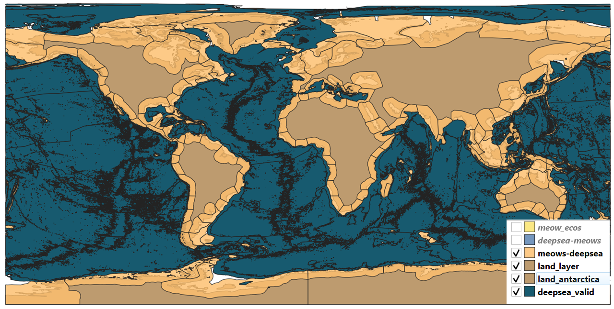{width="626"}

    `QGIS: Vector → Geoprocessing Tools → Difference → Input Layer: MEOW, Overlay Layer: DEEPSEA` `ArcGIS: Geoprocessing → Pairwise Erase, input = meows_ecos, erase = GOODSprovinces_p4s3, output = provinces_p5s1`

-   Step \#2: Creating a shapefile for joining the layers MEOW and DEEPSEA that after step\#1 should be perfectly complementary (no spatial overlap) that I will then call the SEAFLOOR shapefile layer.

    `QGIS: Vector → Data Management Tools → Merge Vector Layers → Input Layers: MEOWS-DEEPSEA, DEEPSEA`

    `ArcGIS: Geoprocessing → Merge, input = provinces_p5s1, input = GOODSprovinces_p4s3, output = provinces_p5s2`

-   Step \#3: extract provinces_p5s2 as a shapefile

-   Step \#4: fix the format of provinces_p5s2 in R

```{r code c., code = readLines(here("./code/create_layer/c.layer_post-processing_1.R")), eval = FALSE}
```

## Part 6: Identify remaining areas

-   Step \#1: two types of areas will not yet be characterized in the SEAFLOOR layer, (i) hadal regions below 6,500m, where we should not really observe species, (ii) regions between 200 and 800m that don't belong to ecoregions. The bathyal layer starts at 800m and onwards, so there are remaining zones to associate with a region.

    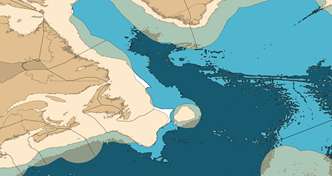 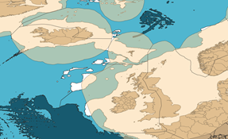

-   Step \#2: get a shapefile with all missing polygons: (merge of seafloor shapefile with a low resolution land layer (does not matter since meows have a bunch of land areas already)

    +---------------------------------------------------------------------------------------------------------------+
    | `-ArcGIS: Pairwise erase, input = ne_10m_land, erase = Provinces_P5S2, output = Provinces_P5S2_PairwiseErase` |
    |                                                                                                               |
    | `-ArcGIS: Merge, input = Provinces_P5S2_PairwiseErase, input = Provinces_P5S2, output = Provinces_P5S2_merge` |
    +---------------------------------------------------------------------------------------------------------------+

-   Step \#3: get polygons that are uncharacterized

    +------------------------------------------------------------------------------------------------------+
    | `-ArcGIS: Create feature, extent of -180;180;-90,90`                                                 |
    |                                                                                                      |
    | `-ArcGIS: Pairwise erase, input = extent, erase = Provinces_P5S2_PairwiseErase, output = holes_p6s2` |
    +------------------------------------------------------------------------------------------------------+

## Part 7: Remove hadal and classify provinces

```{r code d., code = readLines(here("./code/create_layer/d.remove_hadal_from_meows.R")), eval = FALSE}

```

## Part 8: Characterize missing regions

```{r  code e., code = readLines(here("./code/create_layer/e.add_missing_regions.R")), eval = FALSE}

```

# References
